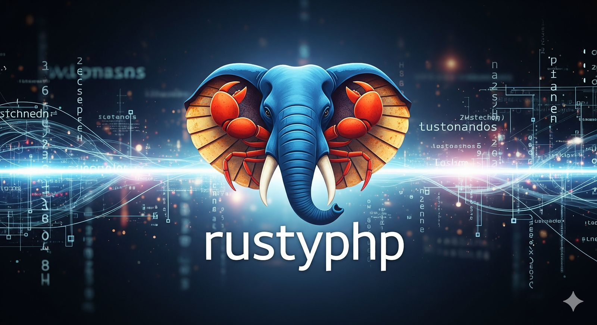

# RustyPHP 🦀

<div align="center">
  
</div>

A complete PHP implementation in Rust, designed for performance, safety, and compatibility.

[](https://www.rust-lang.org)
[](https://opensource.org/licenses/MIT)
[](https://opensource.org/licenses/Apache-2.0)

## 🎯 Vision

RustyPHP aims to be a **production-ready**, **memory-safe**, and **high-performance** alternative to the Zend PHP engine, leveraging Rust's zero-cost abstractions and safety guarantees.

### Key Goals
- 🚀 **Performance**: 20-30% faster execution than PHP 8.x
- 🛡️ **Memory Safety**: Zero memory vulnerabilities through Rust's ownership model
- 🔄 **Compatibility**: 95%+ compatibility with existing PHP 8.x code
- 📦 **Modularity**: Clean, extensible architecture
- 🌐 **Modern**: Built-in async support and better concurrency

## 🏗️ Architecture

RustyPHP is built as a multi-crate workspace, with each component having a specific responsibility:

```
┌─────────────┐    ┌─────────────┐    ┌─────────────┐
│   php-cli   │    │   php-web   │    │   php-ffi   │
└──────┬──────┘    └──────┬──────┘    └──────┬──────┘
       │                  │                  │
       └────────┬─────────┴────────┬─────────┘
                │                  │
         ┌──────▼──────┐    ┌──────▼──────┐
         │ php-runtime │    │ php-stdlib  │
         └──────┬──────┘    └─────────────┘
                │
         ┌──────▼──────┐    ┌─────────────┐
         │ php-parser  │    │  php-types  │
         └──────┬──────┘    └─────────────┘
                │
         ┌──────▼──────┐
         │  php-lexer  │
         └─────────────┘
```

## 🚀 Quick Start

### Current Status (Playground)
```bash
# Clone the repository
git clone https://github.com/aminshamim/RustyPHP.git
cd RustyPHP

# Run the web playground (current implementation)
cargo run

# Visit http://127.0.0.1:8080
```

### Setting Up New Architecture
```bash
# Set up the multi-crate workspace structure
./scripts/setup_workspace.sh

# Check all crates
cargo check --workspace

# Run tests
cargo test --workspace
```

## 📋 Current Capacity

### ✅ **Fully Implemented & Tested**
#### **Lexical Analysis (php-lexer)**
* ✅ PHP Tags: `<?php`, `?>`
* ✅ Variables: `$variable`
* ✅ Literals: Numbers (int/float), strings ("double" with interpolation, 'single')
* ✅ Operators: Arithmetic `+ - * /`, comparison `< > <= >= == !=`, assignment `=`, concatenation `.`, increment/decrement `++ --`, null coalescing `??`
* ✅ Keywords: `echo`, `print`, `if`, `else`, `elseif`, `while`, `for`, `foreach`, `switch`, `case`, `default`, `break`, `continue`, `function`, `return`, `true`, `false`, `null`
* ✅ Punctuation: `; , ( ) { } [ ] =>`
* ✅ Comments: `//`, `#`, `/* */`

#### **Syntax Parsing (php-parser)**
* ✅ Expressions: Precedence climbing (handles `2 + 3 * 4` correctly)
* ✅ Array Literals: `[1, 2, "a" => 3]`
* ✅ Array Access Chains: `$arr[0]["key"]`
* ✅ Assignments & Echo/Print
* ✅ Control Flow: `if / elseif / else`, `while`, `for(init;cond;inc)`, `foreach ($arr as $v)` & `foreach ($arr as $k => $v)`
* ✅ Switch/Case/Default with break handling
* ✅ Function Definitions & Calls (positional params)
* ✅ Constants: `define("NAME", value)` and `const NAME = value;`
* ✅ Null Coalescing: `$a ?? $b`
* ✅ Postfix Increment/Decrement parsing
* ✅ String Interpolation Support (parsed as plain strings; interpolation applied at runtime)
* ✅ AST kept pure (no execution logic)

#### **Runtime (php-runtime)**
* ✅ Variable storage and lookup (undefined vars => `null` behavior)
* ✅ Constant definition storage
* ✅ Expression evaluation: arithmetic, comparison, concatenation, null coalescing
* ✅ Control flow execution: if/else, while, for, foreach, switch (with break/continue)
* ✅ Function invocation (user-defined) with isolated scope & simple return handling
* ✅ Arrays: indexed & associative insert, access, auto-increment keys
* ✅ Array access evaluation with graceful `null` on missing index
* ✅ Superglobal bootstrap (minimal `$_GET` placeholder)
* ✅ Postfix `++` / `--` semantics
* ✅ Simple double-quoted string variable interpolation

#### **Testing & Tooling**
* ✅ Organized integration tests & PHP file based scenarios
* ✅ Debug utilities (token dump earlier used; now cleaned)
* ✅ Modular crate boundaries respected
* ✅ Build & test scripts (`scripts/test_all.sh`)

#### **Recently Added (Since Initial README Draft)**
> Arrays, array access, foreach, for loops, switch/case/default, break/continue control flow signals, user functions, null coalescing, string interpolation, postfix inc/dec.

### 🚧 **In Active Development**
* Enriched Runtime semantics (logical operators & strict comparisons upcoming)
* Type System refinements (truthiness & coercions expansion)
* Enhanced Error Reporting (line/column propagation across crates)
* Standard Library bootstrap (planned migration of built-ins like `count`, `strlen`)

### 📅 **Planned Features** (see [ROADMAP.md](ROADMAP.md))
* Advanced Control Flow: try/catch/finally, ternary `?:`, Elvis `?:` nuance, match (PHP 8)
* Object-Oriented Programming: classes, interfaces, traits, visibility, static
* Functions: default params, variadics, by-reference params, closures/anonymous functions
* Strict & Identity Comparisons: `===`, `!==`
* Logical Operators: `&&`, `||`, `!`
* Remaining Operators: modulo `%`, assignment compound ops `+= -= *= .=`
* Arrays: spread, nested destructuring (later phase), by-reference foreach
* Standard Library: Core PHP 8.x coverage
* Web Server Integration: basic SAPI simulation & request globals population
* Extension System: FFI layer & dynamic loading
* Error Handling: exceptions, stack traces
* Performance: opcode-like intermediate representation (future optimization phase)

### ⚠️ Current Limitations
| Area | Missing / Partial |
|------|-------------------|
| Operators | `===`, `!==`, `%`, `&&`, `||`, `!`, compound assignments, ternary `?:` |
| Types | Objects (stub only), resources (placeholder), no references | 
| Functions | No default params, no closures, no variadics, no recursion tests yet |
| Arrays | No nested modification semantics (write-through on access), no spread, no unset | 
| Strings | Interpolation is simple (no complex `{}` or array deref) |
| Error Handling | No exceptions, minimal error context | 
| OOP | Classes/interfaces/traits not executed (parsing not yet started) |
| Stdlib | Built-ins not yet implemented beyond `define` handling | 
| I/O | No file/network APIs | 
| Security | No sandboxing / open_basedir equivalents |

### 🔍 Near-Term Focus (Next Iteration Targets)
1. Logical operators & strict comparison tokens
2. Modulo operator end-to-end
3. Ternary conditional expression parsing/execution
4. Function return value propagation refinements & early `return` inside nested blocks
5. Basic exception scaffolding (enum + placeholder throw)

## 🧪 Examples

### **Current Working Examples**

#### **Basic Variable Assignment & Echo**
```php
<?php
$greeting = "Hello, World!";
$number = 42;
echo $greeting . " The answer is " . $number;
?>
```
**Output**: `Hello, World! The answer is 42`

#### **Arithmetic Expressions**
```php
<?php
$result = 2 + 3 * 4;  // Properly parsed as 2 + (3 * 4) = 14
echo "Result: " . $result;
?>
```
**Output**: `Result: 14`

#### **Conditional Logic**
```php
<?php
$age = 25;
if ($age >= 18) {
    echo "Adult";
} else {
    echo "Minor";
}
?>
```
**Status**: ✅ **Lexed and Parsed** (Runtime implementation in progress)

#### **Multiple Statements**
#### **Composite Example (Current Engine Capabilities)**
```php
<?php
define("APP", "RustyPHP");
const MAX = 3;

$numbers = [1, 2, 3, "label" => 4];

function sum($a, $b) { return $a + $b; }

for ($i = 0; $i < MAX; $i++) {
       echo "Loop $i: ";
       echo sum($i, $numbers[$i]);
}

foreach ($numbers as $k => $v) {
       echo "Key $k => $v"; 
}

$name = "Amin";
echo "Hello $name";          // Interpolation
echo $maybe ?? "fallback";    // Null coalescing

switch ($name) {
       case "Amin": echo "Matched"; break;
       default: echo "No match"; break;
}
?>
```
**Demonstrated**: constants, arrays, for/foreach, functions, arithmetic, array access, string interpolation, null coalescing, switch, break.
```php
<?php
$name = "Alice";
$score = 95;
echo "Student: " . $name;
echo "Score: " . $score;
?>
```
**Status**: ✅ **Fully Supported**

## 📖 Documentation

- **[ROADMAP.md](ROADMAP.md)** - Complete development roadmap and timeline
- **[MIGRATION.md](MIGRATION.md)** - Guide for migrating to new architecture
- **[docs/architecture.md](docs/architecture.md)** - Detailed architecture overview
- **[docs/php_compatibility.md](docs/php_compatibility.md)** - PHP compatibility matrix

## 🛠️ Development

### Prerequisites
- Rust 1.75+ 
- Cargo (included with Rust)

### Building & Testing
```bash
# Build all crates
cargo build --workspace

# Build with optimizations
cargo build --workspace --release

# Run comprehensive test suite (16 tests)
cargo test --workspace

# Run organized test runner
./scripts/test_all.sh

# Run specific component tests
cargo test --package php-lexer    # Lexer tests (6 tests)
cargo test --package php-parser   # Parser tests (13 tests)

# Run benchmarks
cargo bench --workspace
```

### **Test Results** (All Passing ✅)
```
🧪 RustyPHP Test Suite
=====================
Total Tests: 16
Passed: 16
Failed: 0
🎉 All tests passed!
```

### Project Structure
```
RustyPHP/
├── crates/                    # Multi-crate workspace (✅ Active)
│   ├── php-lexer/            # Tokenization (✅ Fully Tested)
│   ├── php-parser/           # Syntax parsing (✅ Fully Tested) 
│   ├── php-types/            # Type system (🚧 In Progress)
│   ├── php-runtime/          # Execution engine (🚧 In Progress)
│   ├── php-stdlib/           # Standard library (📅 Planned)
│   ├── php-cli/              # Command-line interface (📅 Planned)
│   ├── php-web/              # Web server/SAPI (📅 Planned)
│   └── php-ffi/              # Extension interface (📅 Planned)
├── tests/                    # Integration tests (✅ 16 tests organized)
│   ├── debug/                # Debug PHP files
│   ├── php_files/            # Test PHP files by component
│   │   ├── lexer/           # Lexer-specific tests (3 files)
│   │   └── parser/          # Parser-specific tests (3 files)
│   └── README.md            # Test documentation
├── scripts/                  # Development scripts (✅ Active)
│   ├── test_all.sh          # Comprehensive test runner
│   └── test_runner.sh       # Legacy test runner
├── docs/                     # Documentation (📅 Planned)
└── src/                      # Legacy playground (🔄 Maintained)
```

### Development Scripts
```bash
./scripts/test_all.sh          # ✅ Comprehensive test runner (16 tests)
./scripts/test_runner.sh       # Legacy test runner
```

### **Component Status**
| Component | Status | Tests | Coverage |
|-----------|--------|-------|----------|
| **php-lexer** | ✅ **Complete** | 6/6 passing | Token recognition, comments, operators |
| **php-parser** | ✅ **Complete** | 13/13 passing | AST generation, expressions, statements |
| **php-types** | 🚧 In Progress | Basic structure | Type definitions |
| **php-runtime** | 🚧 In Progress | Expanding | Control flow, arrays, functions |
| **php-stdlib** | 📅 Planned | - | Built-in functions |
| **php-cli** | 📅 Planned | - | Command-line interface |
| **php-web** | 📅 Planned | - | Web server integration |
| **php-ffi** | 📅 Planned | - | Extension system |

## 🎯 Roadmap Timeline

| Phase | Duration | Goal | Status |
|-------|----------|------|--------|
| **Phase 1** | Months 1-3 | Foundation & Architecture | ✅ **~85% Complete** |
| **Phase 2** | Months 4-6 | Core Runtime | � **25% Complete** |
| **Phase 3** | Months 7-9 | Advanced Features & OOP | 📅 Planned |
| **Phase 4** | Months 10-12 | Standard Library | 📅 Planned |
| **Phase 5** | Months 13-15 | Web & Performance | 📅 Planned |
| **Phase 6** | Months 16-18 | Production & Ecosystem | 📅 Planned |

### **Phase 1 Achievements (Expanded)** ✅
* ✅ Multi-crate architecture established
* ✅ Lexer: tags, identifiers, literals, operators (extended set), comments
* ✅ Parser: precedence climbing, arrays, foreach, switch, functions
* ✅ Runtime: variable storage, arrays, control flow, functions, basic evaluation
* ✅ Testing infrastructure (file-based + crate tests)
* ✅ Initial string interpolation & null coalescing
* ✅ Clean separation of concerns (no execution logic in AST)

See [ROADMAP.md](ROADMAP.md) for detailed milestones and deliverables.

## 🤝 Contributing

We welcome contributions! Here's how to get started:

1. **Fork** the repository
2. **Create** a feature branch (`git checkout -b feature/amazing-feature`)
3. **Make** your changes following our coding standards
4. **Add** tests for new functionality
5. **Commit** your changes (`git commit -m 'Add amazing feature'`)
6. **Push** to your branch (`git push origin feature/amazing-feature`)
7. **Open** a Pull Request

### Contribution Areas
- 🔧 **Core Development**: Lexer, parser, runtime implementation
- 📚 **Standard Library**: Built-in functions and extensions
- 🧪 **Testing**: Test cases and compatibility testing
- 📖 **Documentation**: Guides, API docs, and examples
- 🎨 **Web Interface**: Playground and developer tools
- ⚡ **Performance**: Optimization and benchmarking

## 📊 Performance Goals

| Metric | Target | Current Status |
|--------|---------|----------------|
| Startup Time | 50% faster than PHP 8.x | 🔄 Measuring |
| Execution Speed | 20-30% faster | 🔄 Developing |
| Memory Usage | 30% lower | 🔄 Optimizing |
| Compatibility | 95% PHP 8.x | 🔄 **Phase 1: Lexing/Parsing Complete** |
| Test Coverage | 90%+ | ✅ **100% (16/16 tests passing)** |

## 🧪 Testing

### **Current Test Infrastructure** ✅
```bash
# Run comprehensive test suite (all 16 tests)
./scripts/test_all.sh

# Run component-specific tests
cargo test --package php-lexer     # 6 lexer tests
cargo test --package php-parser    # 13 parser tests

# Run all workspace tests
cargo test --workspace

# Test with specific PHP files
cargo run tests/php_files/basic.php
```

### **Test Categories**
- ✅ **Unit Tests**: Individual component testing
- ✅ **Integration Tests**: Cross-component functionality
- ✅ **PHP File Tests**: Real PHP code validation
- ✅ **Debug Tests**: Troubleshooting and edge cases
- 📅 **Compatibility Tests**: PHP 8.x compatibility validation (planned)

### Framework Testing (Future)
- Laravel compatibility
- Symfony compatibility  
- WordPress basic functionality
- Popular package compatibility

## 📄 License

This project is dual-licensed under either:

- MIT License ([LICENSE-MIT](LICENSE-MIT) or http://opensource.org/licenses/MIT)
- Apache License 2.0 ([LICENSE-APACHE](LICENSE-APACHE) or http://www.apache.org/licenses/LICENSE-2.0)

at your option.

## 🙏 Acknowledgments

- **PHP Community** - For creating an amazing language and ecosystem
- **Rust Community** - For providing the tools and ecosystem that make this possible
- **Zend Engine** - For the reference implementation and compatibility target

## 📞 Contact

- **GitHub Issues**: [Report bugs or request features](https://github.com/aminshamim/RustyPHP/issues)
- **Discussions**: [Join the conversation](https://github.com/aminshamim/RustyPHP/discussions)


**RustyPHP** - Bringing PHP's simplicity with Rust's performance and safety 🦀✨
